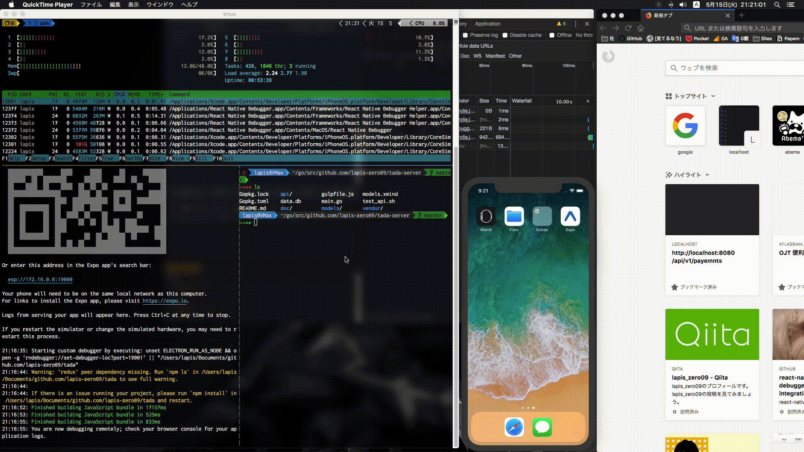

# tada



## run

### run server

```
rm -f data.db && go run main.go
```

### run client

```shell
yarn run s
```

if you can use React Native Debugger

```shell
REACT_DEBUGGER="unset ELECTRON_RUN_AS_NODE && open -g 'rndebugger://set-debugger-loc?port=19001' ||" yarn run s
```

## lint

```shell
yarn run lint
```

## help

Somethimes you need ....

```shell
sudo sysctl -w kern.maxfiles=5242880
sudo sysctl -w kern.maxfilesperproc=524288
```
